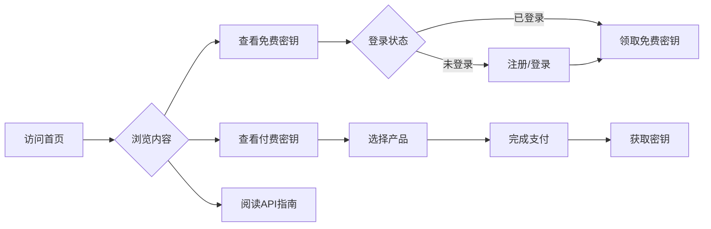

## 1. Product Overview
API Key Hub - 一个提供免费限量API Key和付费API Key售卖的中转平台，帮助开发者快速获取各类API服务。目标用户为开发者和小型团队，提供便捷的API密钥获取渠道。

## 2. Core Features

### 2.1 User Roles
| Role | Registration Method | Core Permissions |
|------|---------------------|------------------|
| Guest User | None | Browse free keys, view tutorials |
| Registered User | Email/Google OAuth | Claim free keys, purchase paid keys |

### 2.2 Feature Module
1. **Home Page**: Hero section, navigation, featured API categories, AdSense integration
2. **Free Keys Page**: Limited free API keys with rate limiting
3. **Paid Keys Page**: Premium API key products for sale
4. **API Guides Page**: Tutorials and documentation to meet AdSense content requirements

### 2.3 Page Details
| Page Name | Module Name | Feature description |
|-----------|-------------|---------------------|
| Home Page | Hero Section | Attractive landing banner with CTA buttons |
| Home Page | Category Cards | Display popular API categories |
| Home Page | Ad Banner | Google AdSense ad placement |
| Free Keys Page | Key List | Show available free keys with claim limits |
| Free Keys Page | Claim Form | User authentication and key claiming |
| Paid Keys Page | Product Cards | Display paid API key products |
| Paid Keys Page | Purchase Flow | Payment integration for key purchase |
| API Guides Page | Tutorial List | Educational content for AdSense eligibility |

## 3. Core Process
用户访问首页 → 浏览免费/付费API Key → 注册/登录 → 领取免费密钥或购买付费密钥 → 获取密钥并开始使用

## 4. User Interface Design
### 4.1 Design Style
- Primary Color: Deep blue (#1e40af) - Trust and reliability for API services
- Secondary Color: Cyan (#06b6d4) - Modern tech feel
- Button Style: Rounded corners (8px), gradient backgrounds
- Font: Inter for body, Montserrat for headings
- Layout: Card-based design with clean whitespace
- Animation: Smooth transitions, hover effects on cards

### 4.2 Page Design Overview
| Page Name | Module Name | UI Elements |
|-----------|-------------|-------------|
| Home Page | Hero | Large gradient background, bold heading, two CTA buttons |
| Home Page | Categories | Grid of cards with icons and descriptions |
| Home Page | Ad Banner | Responsive ad slot below hero section |
| Free Keys Page | Key Cards | List view with key name, quota, claim button |
| Paid Keys Page | Pricing Cards | Tiered pricing with feature comparison |
| API Guides | Tutorial Cards | Blog-style card layout with thumbnails |

### 4.3 Responsiveness
- Desktop-first approach with mobile adaptation
- Mobile: Single column layout, hamburger menu
- Tablet: Two-column grid for categories
- Touch optimization for buttons and cards

### 4.4 SEO Requirements
- Meta tags optimized for "API key", "free API", "developer tools"
- Semantic HTML structure
- Original content for AdSense approval