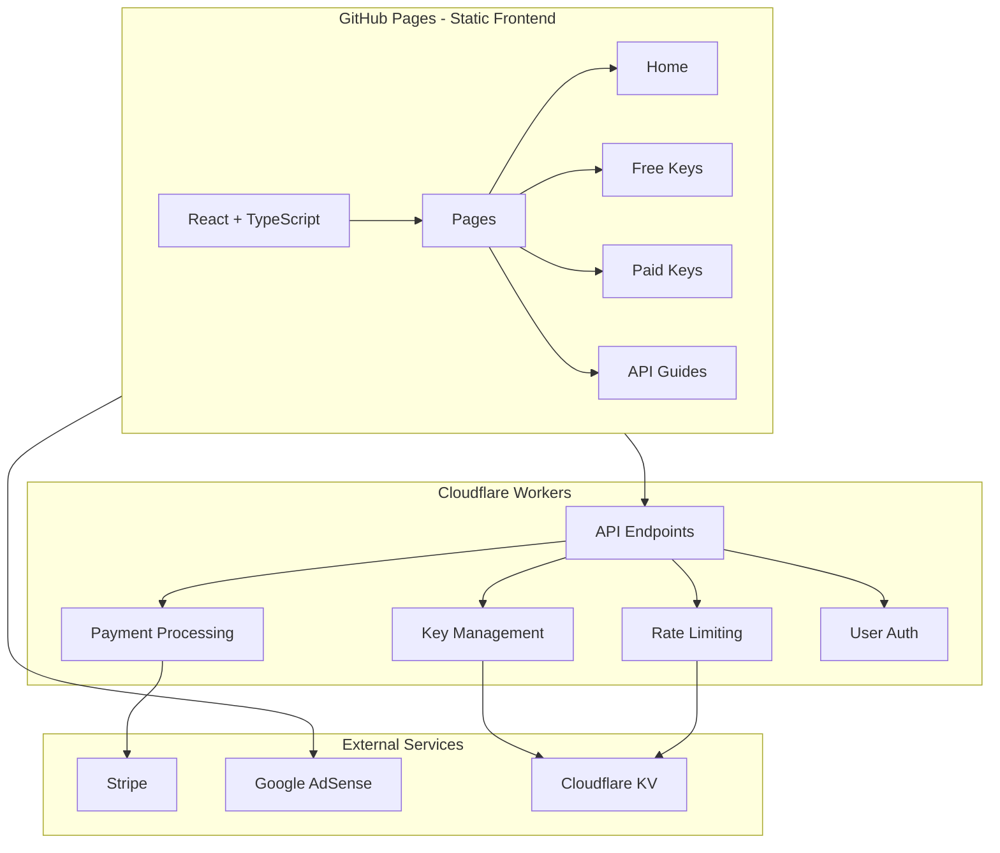
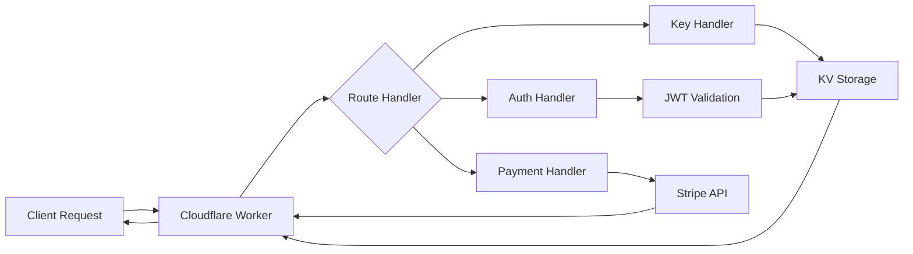
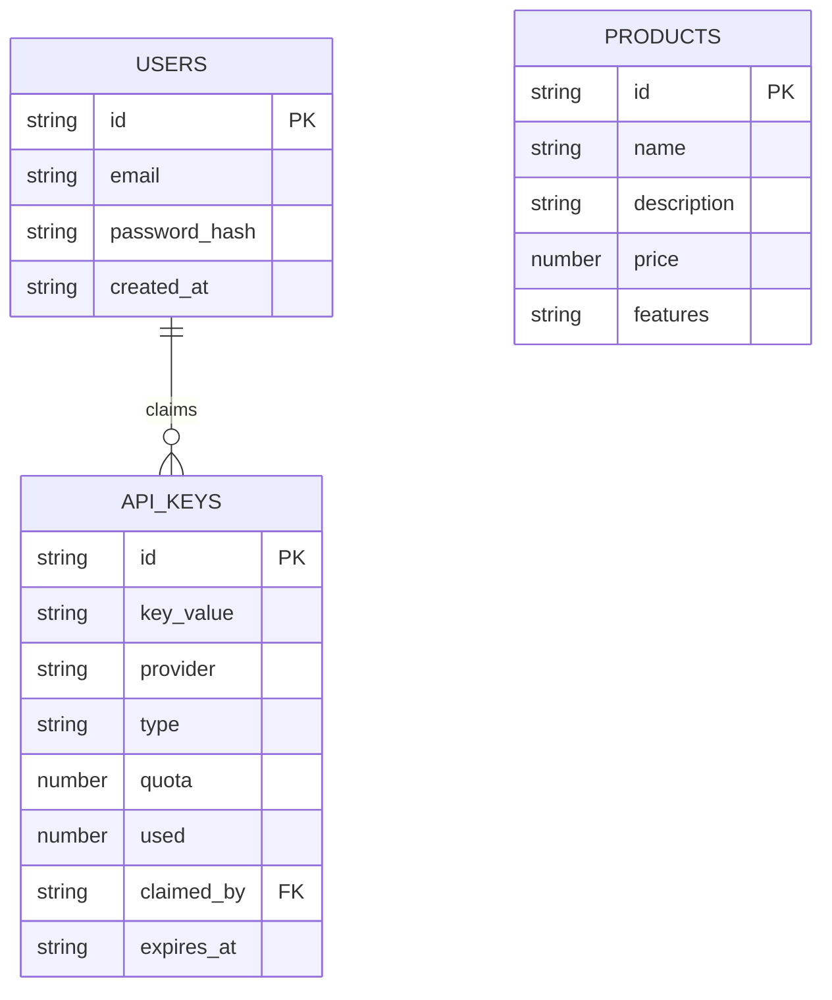

## 1. Architecture Design


## 2. Technology Description
- Frontend: React@18 + TypeScript + TailwindCSS@3 + Vite@6
- Initialization Tool: vite-init with react-ts template
- Backend: Cloudflare Workers (serverless)
- Database/Storage: Cloudflare KV for key storage and rate limiting
- Payment: Stripe API integration
- Authentication: JWT tokens stored in localStorage
- CDN: Cloudflare CDN for global distribution

## 3. Route Definitions
| Route | Purpose | Component |
|-------|---------|-----------|
| / | Home page with hero, categories, ads | Home.tsx |
| /free-keys | Free API keys listing with claim functionality | FreeKeys.tsx |
| /paid-keys | Paid API key products for purchase | PaidKeys.tsx |
| /guides | API tutorials and documentation | Guides.tsx |
| /login | User authentication | Login.tsx |

## 4. API Definitions (Cloudflare Workers)

### 4.1 Authentication Endpoints
| Endpoint | Method | Description |
|----------|--------|-------------|
| /api/auth/login | POST | User login with email/password |
| /api/auth/register | POST | User registration |
| /api/auth/verify | GET | Verify JWT token |

### 4.2 Key Management Endpoints
| Endpoint | Method | Description |
|----------|--------|-------------|
| /api/keys/free | GET | Get list of free API keys |
| /api/keys/free/claim | POST | Claim a free API key (rate limited) |
| /api/keys/paid | GET | Get paid API key products |
| /api/keys/paid/purchase | POST | Purchase a paid API key |

### 4.3 Response Schemas
```typescript
interface ApiKey {
  id: string;
  name: string;
  provider: string;
  description: string;
  quota: number;
  remaining: number;
  type: 'free' | 'paid';
  price?: number;
}

interface ClaimResponse {
  success: boolean;
  message: string;
  key?: string;
  expiresAt?: string;
}

interface PurchaseResponse {
  success: boolean;
  message: string;
  key?: string;
  stripeSessionId?: string;
}
```

## 5. Server Architecture Diagram


## 6. Data Model
### 6.1 Data Model Definition


### 6.2 KV Storage Structure
- `users:{userId}`: User profile data
- `free_keys:{keyId}`: Free API key details
- `paid_keys:{keyId}`: Paid API key details  
- `rate_limit:{userId}:{keyType}`: Rate limiting counters
- `products:{productId}`: Product pricing info

### 6.3 Environment Variables
| Variable | Purpose |
|----------|---------|
| JWT_SECRET | Secret for signing JWT tokens |
| STRIPE_SECRET_KEY | Stripe API key |
| STRIPE_WEBHOOK_SECRET | Stripe webhook signature |

## 7. Google AdSense Integration
- Ad slots placed in:
  - Hero section sidebar
  - Between content sections
  - Sidebar (desktop)
  - Bottom of pages
- Responsive ad units for mobile compatibility
- AdSense auto ads enabled for better optimization